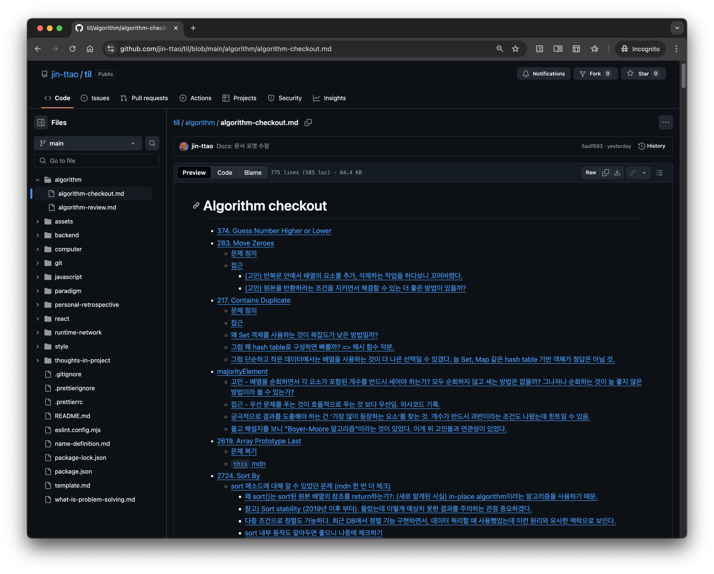
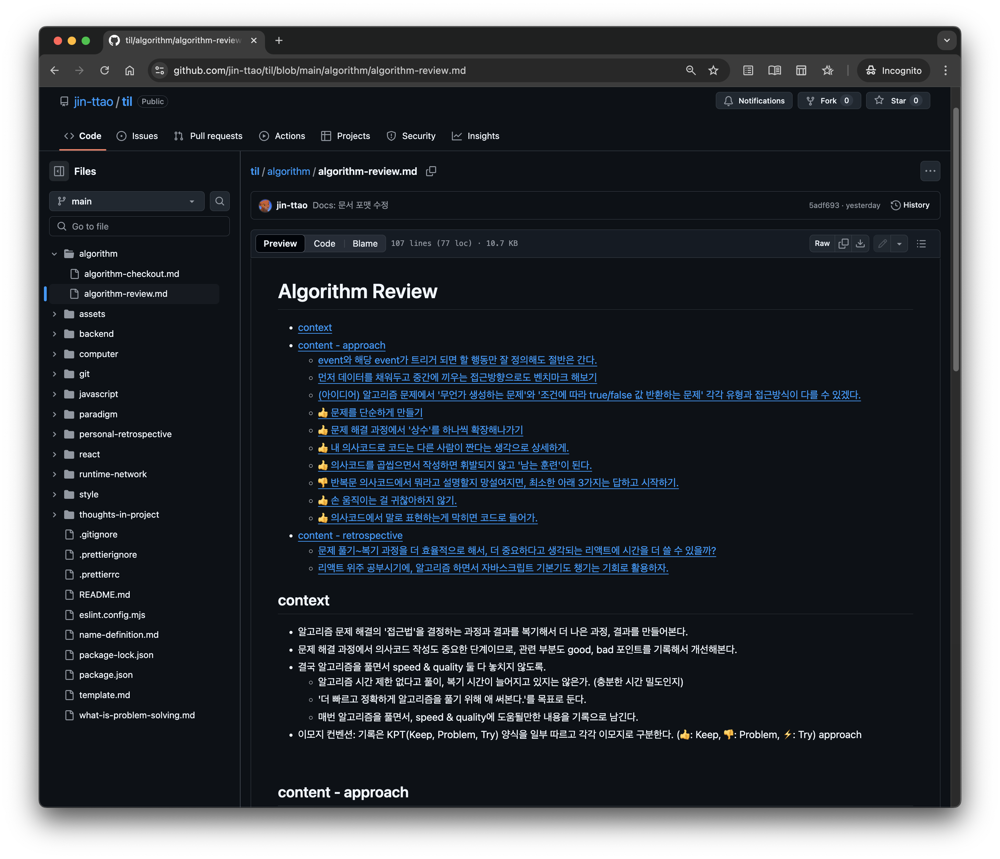

# 알고리즘

- 알고리즘 연습과정을 구체적으로 기록해본다.
- 문제를 쪼개고, 생각을 코드로 만들어내는 과정이 어떻게 진행되는지 복기할 것.
- 예시 [majorityElement](https://github.com/jin-ttao/til/blob/main/algorithm/algorithm-checkout.md#majorityelement)
  > - (고민) 배열을 순회하면서 각 요소가 포함된 개수를 반드시 세어야 하는가? 모두 순회하지 않고 세는 방법은 없을까? 그나저나 순회하는 것이 늘 좋지 않은 방법이라 볼 수 있는가?
  > - (접근) 우선 문제를 푸는 것이 효율적으로 푸는 것 보다 우선임. 의사코드 기록.
  > - 궁극적으로 결과를 도출해야 하는 건 ‘가장 많이 등장하는 요소’를 찾는 것. 개수가 반드시 과반이라는 조건도 나왔는데 힌트일 수 있음.
  > - 풀고 해설지를 보니 "Boyer-Moore 알고리즘"이라는 것이 있었다. 이게 위 고민들과 연관성이 있었다.

 

## 알고리즘 풀고 배운 것

[문서 바로가기](https://github.com/jin-ttao/til/blob/main/algorithm/algorithm-checkout.md)

 

## 알고리즘 풀이 습관 복기

[문서 바로가기](https://github.com/jin-ttao/til/blob/main/algorithm/algorithm-review.md)

